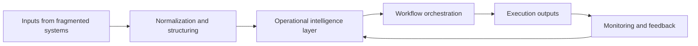

# Runway Fuel

**Runway Fuel** builds software and infrastructure for complex, high-friction operational environments.

We focus on designing systems that make fragmented workflows easier to understand, easier to coordinate, and easier to execute. The public profile is intentionally selective: we explain the problem shape, the operating model, and the engineering philosophy without exposing implementation details or market-specific playbooks.

## What we do

Runway Fuel works on the layer between raw operational complexity and reliable execution. In practice, that means turning disconnected inputs, inconsistent processes, and hard-to-manage dependencies into a system that can be structured, monitored, and improved over time.

Our approach is product-led, infrastructure-aware, and execution-focused. We care about systems that are not only technically sound, but also clear enough for real teams to use under pressure.

## What the solution looks like

At a high level, the solution follows a simple pattern. Inputs come in from multiple sources, are standardized into a usable operational model, pass through workflow and decision layers, and then produce outputs that are measurable and continuously improved.

This model is deliberate. It explains **how** the platform thinks without disclosing the exact niche, internal logic, or proprietary implementation choices.

## What we believe

We believe that strong software in operational settings must satisfy five conditions.

| Principle | Meaning |
|---|---|
| **Clarity before complexity** | The system should make reality easier to read, not harder to interpret. |
| **Structured execution** | Useful software reduces coordination drag and makes action more dependable. |
| **Operational resilience** | The system should support real-world use, not just ideal demos. |
| **Measured improvement** | Feedback loops matter as much as first delivery. |
| **Protected advantage** | Public communication should be clear, but the strategic core should remain private. |

## How we build

The organization is structured to support disciplined product development. Public-facing assets will stay minimal, while internal systems are separated cleanly by repository, environment, and deployment path.

| Layer | Purpose |
|---|---|
| **Organization profile** | Public overview, direction, and credibility layer |
| **Private repositories** | Core product code, experiments, and internal tooling |
| **Deployment layer** | Controlled release workflows for web and infrastructure assets |
| **Cloud environments** | Isolated execution and operations environments |

## Current status

Runway Fuel is in an active build phase. The public profile will remain intentionally compact while the product, systems, and infrastructure mature.

If you are visiting this page early, that is expected. The organization is being built with long-term structure in mind from day one.

## Working model

Runway Fuel is being developed with a strong emphasis on clean ownership, high-quality execution, and scalable infrastructure. That includes separation between public presence, internal product work, deployment environments, and future operating entities.

This is not an open playbook. It is a professional build surface.

## Based in

**Frankfurt am Main, Germany**

## Notes for future collaborators

If and when collaboration opens, contributors should expect a workflow centered on repository discipline, review quality, clear ownership boundaries, and production-minded engineering standards.

Until then, this organization profile serves as the public front door.
