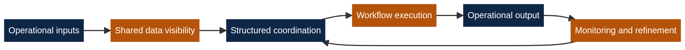
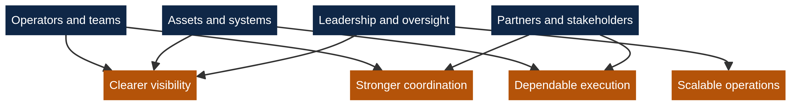

  

  
  
  

# Runway Fuel

**Runway Fuel** builds software and digital infrastructure for complex operational environments that require stronger visibility, cleaner coordination, and more dependable execution.

We focus on the operating layer between fragmented inputs and structured outcomes. This public profile explains **what we do**, who it serves, and the value it creates, while intentionally keeping proprietary implementation details private.

## Table of Contents

1. [Overview](#overview)
2. [What we do](#what-we-do)
3. [What value this creates](#what-value-this-creates)
4. [Who this is for](#who-this-is-for)
5. [Public operating view](#public-operating-view)
6. [Operational value view](#operational-value-view)
7. [Public repository structure](#public-repository-structure)
8. [Licensing](#licensing)
9. [Based in](#based-in)
10. [References](#references)

## Overview

Runway Fuel is designed for environments where work becomes harder because information is scattered, dependencies are difficult to track, and execution quality depends on coordination across people, systems, and decisions.

Our role is to provide the digital surface that makes these environments easier to see, easier to organize, and easier to operate. We build software and infrastructure that support clearer operational control without exposing the internal logic that creates our strategic edge.

## What we do

At a public level, Runway Fuel provides a structured digital layer for high-friction operations.

That includes software and infrastructure that help organize inputs, improve shared visibility, support workflow execution, and strengthen ongoing operational oversight.

| Public function | What it means |
|---|---|
| **Operational visibility** | We make important activity easier to see, understand, and monitor. |
| **Workflow coordination** | We support execution across processes that involve multiple steps, dependencies, or teams. |
| **Structured execution support** | We help turn operational complexity into repeatable digital workflows. |
| **Monitoring and reporting** | We create a cleaner operational record for review, control, and improvement. |
| **Scalable infrastructure** | We build with long-term operational growth and discipline in mind. |

This profile is intentionally selective. It is meant to be clear, credible, and useful without disclosing sensitive commercial logic, internal systems design, or implementation detail.

## What value this creates

Complex operating environments usually break down in predictable ways: visibility comes too late, coordination depends on manual follow-up, and execution becomes inconsistent when pressure increases.

Runway Fuel addresses that class of problem by creating a more structured operational interface. The result is stronger visibility, tighter coordination, more dependable execution, and a better foundation for scaling operational activity with discipline.

## Who this is for

Runway Fuel is built for organizations and operating settings where execution quality depends on structure, timing, and dependable coordination.

| Stakeholder group | Public relevance |
|---|---|
| **Operators and teams** | A clearer environment for day-to-day execution and operational follow-through. |
| **Asset and system owners** | Better visibility into activity, dependencies, and operating status. |
| **Partners and stakeholders** | A more structured framework for coordination and shared execution. |
| **Leadership and oversight roles** | Cleaner reporting surfaces and stronger operational control. |

## Public operating view

The diagram below shows the public operating surface of Runway Fuel. It explains the visible problem shape and the value layer we address without exposing private implementation details.

Runway Fuel sits between raw operational inputs and reliable outcomes. We focus on improving shared visibility, enabling structured coordination, supporting workflow execution, and creating a stronger basis for monitoring and refinement over time.

## Operational value view

The platform is designed to create value across the full operating environment rather than for one isolated user alone.

This matters because strong operations depend on alignment between the people executing work, the systems holding information, the stakeholders coordinating around outcomes, and the leadership layer responsible for oversight.

## Public repository structure

This public profile repository exists to present the organization clearly while keeping public communication separate from private product development.

| Public layer | Purpose |
|---|---|
| **`.github/profile/README.md`** | Public-facing organization overview |
| **`profile/assets/`** | Images used by the public README |
| **Private repositories** | Product code, internal tooling, commercial systems, and protected implementation |

If you are viewing this organization publicly, you are seeing the public front door rather than the internal product surface.

## Licensing

This public `.github` repository is aligned with **Apache License 2.0**.

> **Important:** the Apache-2.0 license attached to this public repository applies to the public profile repository and its published assets unless stated otherwise. It does **not** grant public rights to any separate private repositories, internal systems, or proprietary commercial code owned and operated by Runway Fuel.

## Based in

**Frankfurt am Main, Germany**

## References
[1]: https://opensource.org/license/apache-2-0 "Open Source Initiative - Apache License 2.0"
